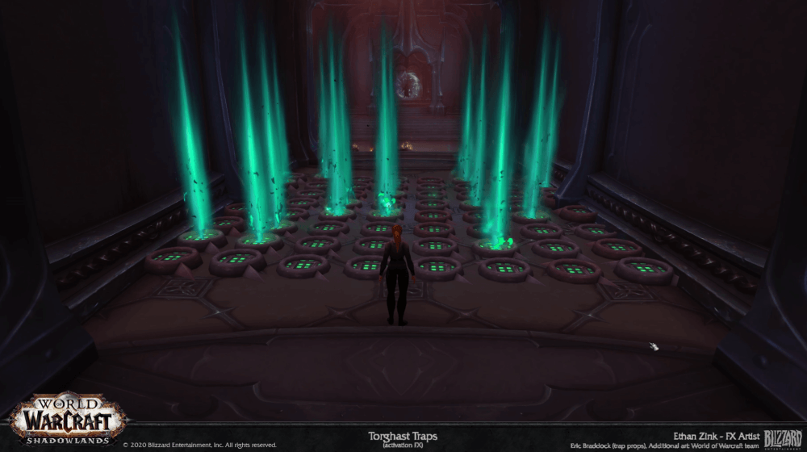
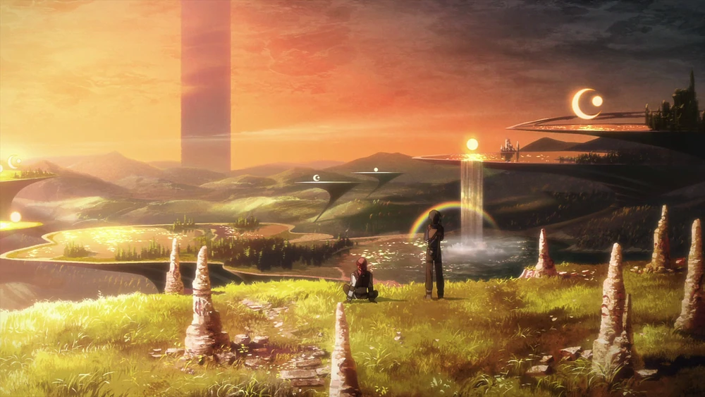
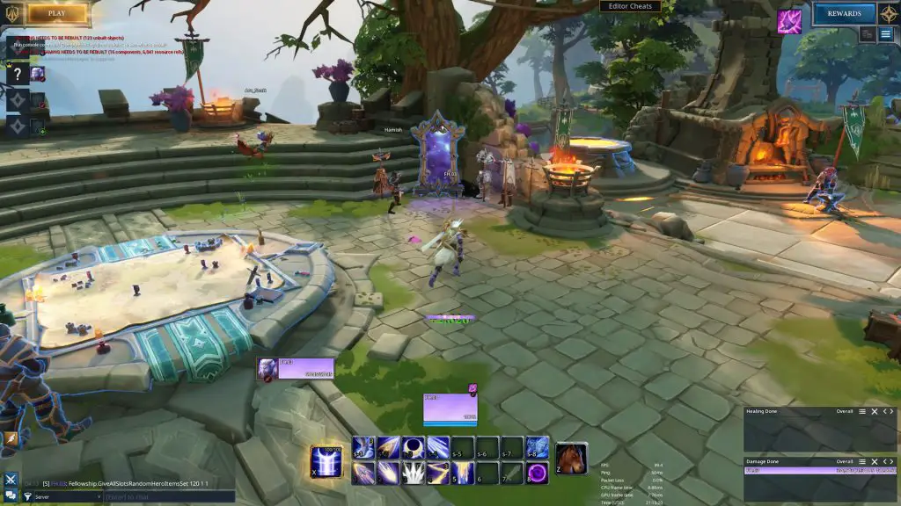
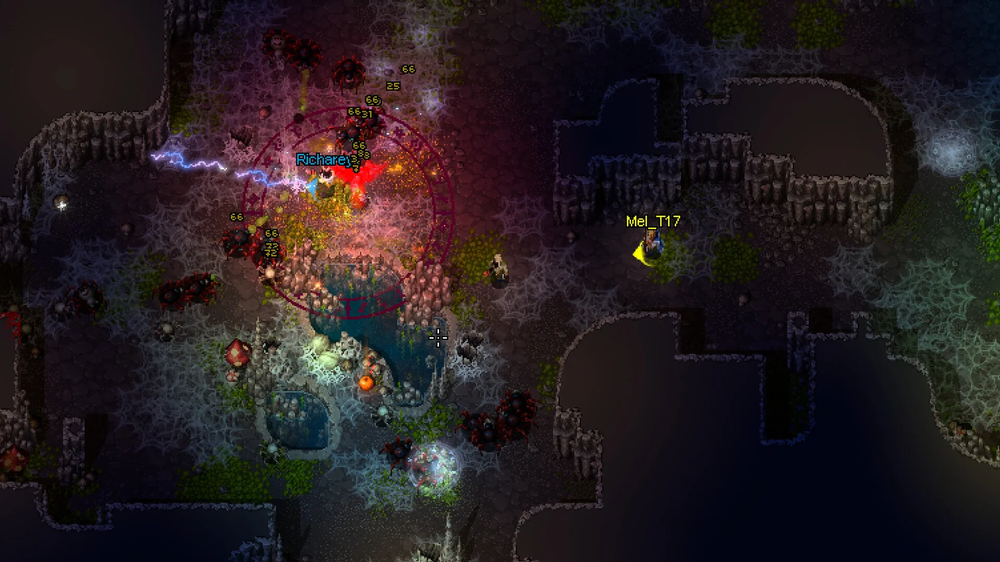

# 🏰 Tower of the Goddess (Working Title)

---

## 1. The Hook & Vision

> "Imagine you are an adventurer whose dream is to reach the top of the Tower and learn the truth of the world. Through twists and turns of destiny, a Goddess chose you as one of her champions, and now you have the potential to reach the very top."

### 🎨 Visual Mood Gallery

---

## 2. Reference Analysis

### 🎮 Reference Games
*   **World of Warcraft (Mythic+):** We are looking at this for its peak execution-heavy dungeon combat, precise positioning, and class synergy requirements.
*   **Ragnarok Online / Path of Exile:** We are looking at these for their completely unbound character building and skill tree freedom, allowing players to discover emergent synergies rather than picking strict classes.
*   **Danmachi / Tower of God / Sword Art Online:** We are looking at these for the narrative wrapper: climbing a lethal, mysterious megastructure guided by a divine patron.

### 📥 The "Keep" List (What we are emulating)
*   The frantic, high-execution combat of Mythic+ (positioning, interrupts, role execution).
*   The core WoW combat feel: Global Cooldowns (GCD), 1-key-to-1-skill mapping, and tab-targeting.
*   Trash mobs acting as mechanical tutorials for the upcoming boss.
*   Total build freedom (no strict classes) allowing players to discover emergent synergies to fulfill Tank/Healer/DPS roles.
*   The **"Tent"** mechanic: a safe zone before bosses to completely and freely respec without harsh run-back penalties.
*   The narrative wrapper of climbing a mysterious Tower, guided by a patron Goddess who handles your progression.

### 🗑️ The "Discard" List (What we are avoiding)
> [!WARNING] Anti-Patterns
> *   **The "MMO" Bloat:** We are exclusively focused on the structured dungeon experience. No open-world questing, no massive cities, no tedious leveling grinds.
> *   **Respec Costs:** Completely discarded. Experimentation must be 100% free.
> *   **Strict Class Structures:** Players shouldn't be locked into "Paladin" or "Mage," but instead build their toolkit a la carte.

---

## 3. Core Identity

> [!IMPORTANT] Elevator Pitch
> A highly-tuned, 5-player dungeon crawler that strips away MMO bloat to deliver pure, WoW-style Mythic+ combat. Players climb a lethal, divine Tower using completely unbound skill trees to forge their own emergent roles (Tank, Healer, DPS), utilizing safe-zone Tents to freely experiment and adapt before punishing boss encounters.

### 📊 Genre & Format
*   **Genre:** Co-op Dungeon Crawler / Action RPG
*   **Format:** 3D, Multiplayer (5-player Co-op)
*   **Target Audience:** Hardcore MMO veterans and ARPG theorycrafters who love intense dungeon coordination and deep build experimentation, but lack the time for open-world grinding.

### 🏛️ Core Pillars
1.  **Mastery Through Iteration:** Bosses are puzzles to be solved. Trash mobs teach the pieces; the boss tests the whole. The Tent ensures failure is a learning opportunity, not a punishment.
2.  **Unbound Synergy:** Classes do not exist. Players discover and forge their own emergent roles (Tank, Healer, DPS) through a massive, freely respec-able pool of skills and stats.
3.  **Pure Dungeon Distillation:** The core WoW Mythic+ tab-target combat feel, completely stripped of MMO open-world bloat. The dungeon *is* the game.

### 📖 Narrative & Lore Foundation
The world revolves around a colossal, impossible Tower. Adventurers risk their lives climbing it to uncover the truth of the world. Progression is managed entirely by a patron Goddess—a divine entity who consolidates your stats, resets your builds, and raises your skill ceiling as you conquer higher floors. Her influence extends into the Tower via "Tents," safe havens where adventurers can regroup and adapt to the horrors ahead.